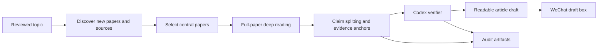

# ResearchRadar


Daily research briefs for people who want the paper, the evidence, and the draft, not another loose
summary. Give ResearchRadar a reviewed topic; it finds new papers, deep-reads the central ones,
checks each public claim against source anchors, and leaves a long-form WeChat draft for you to
review.

`Local-first` · `Evidence-gated` · `Full-paper reading` · `WeChat draft` · `Scheduler`

`DeepSeek reader` · `Codex verifier` · `Tavily recall` · `OpenAI-compatible providers`

[简体中文](README.zh-CN.md) · [Detailed usage](docs/usage.md) ·
[Provider configuration](docs/providers.md) · [Architecture](docs/architecture.md) ·
[Security](docs/security.md)

## What It Does

Most research bots summarize whatever they find. ResearchRadar is stricter. Search improves recall,
but public claims must come from ingested papers or trusted source artifacts with complete evidence
anchors.

### How a daily brief is made



The default daily path is:

1. discover sources with paper-first ranking and Tavily recall;
2. deep-read selected papers with DeepSeek v4 Pro;
3. verify claims with Codex `gpt-5.5`;
4. render a readable long-form article;
5. create a WeChat draft, never an automatic publish.

## Output

Each successful daily run creates:

- a WeChat draft-ready long-form article for review in the Official Account editor;
- a local HTML preview with safe paper figures when available;
- verified claims with exact source anchors;
- audit artifacts for rejected, weak, or unsupported claims.

## Quick Start

Daily use is intentionally simple: configure reviewed topics and secrets once, then check the
WeChat draft box when the scheduled job runs.

Install dependencies and initialize local config:

```bash
uv sync --extra dev
uv run research-radar init
```

`config.example.yaml` is a public template. Put your real reviewed topics in local
`config.yaml`; it is gitignored and should not be committed.

Store local secrets in Keychain, then confirm readiness:

```bash
uv run research-radar secrets set deepseek
uv run research-radar secrets set web-search
uv run research-radar secrets set wechat
uv run research-radar secrets status
```

Run a daily research brief:

```bash
uv run research-radar run daily \
  --topic <topic-id> \
  --config config.yaml \
  --root research-radar-data \
  --language zh \
  --model-cache
```

Create a WeChat draft for review:

```bash
uv run research-radar publish wechat-draft \
  --run runs/<date-topic> \
  --title "ResearchRadar: <topic>" \
  --digest "One-sentence reviewed digest" \
  --thumb-media-id "<wechat-thumb-media-id>"
```

Schedule a daily WeChat draft job:

```bash
uv run research-radar schedule daily-draft \
  --topic <topic-id> \
  --time 09:00 \
  --config config.yaml \
  --root research-radar-data \
  --thumb-media-id "<wechat-thumb-media-id>" \
  --language zh \
  --model-cache
```

## Quality Boundary

Public reports only use supported claims with complete source anchors. Internal artifacts such as
`review_report.md`, `claims.jsonl`, `sources.jsonl`, and `runtime_summary.json` stay available for
audit, but the reader-facing article is built from verified content.

WeChat and future publishing channels are downstream renderers. The research model remains the
same: discover broadly, read deeply, verify conservatively, and keep every run auditable.

## More

- [Detailed usage](docs/usage.md) covers setup, providers, single-paper runs, WeChat drafts,
  scheduler installation, and privacy checks.
- [Provider configuration](docs/providers.md) shows how to add OpenAI-compatible APIs, local
  servers, or CLI agent providers without changing public examples.
- [Architecture](docs/architecture.md) describes the source-to-draft pipeline.
- [Security](docs/security.md) documents secret handling and privacy boundaries.
- [Roadmap](docs/todo.md) tracks product and engineering priorities.

## License

MIT
