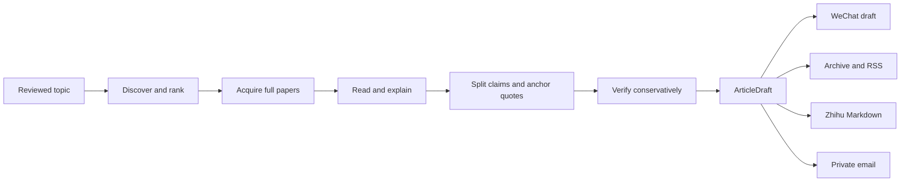

# ResearchRadar


**Turn a reviewed research topic into a daily article whose claims point back to the source.**

ResearchRadar watches a topic for new work, chooses the papers worth reading, reads the full text,
and checks public claims against exact source anchors. It runs locally and leaves the finished article
where you want to review it: the WeChat draft box, a public web archive with RSS, a Markdown export,
or your private inbox.

[简体中文](README.zh-CN.md) ·
[Live Archive](https://sleepylgod.github.io/research-radar/archive/) ·
[RSS](https://sleepylgod.github.io/research-radar/archive/feed.xml) ·
[Usage](docs/usage.md) · [Providers](docs/providers.md)

`Local-first` · `Full-paper reading` · `Evidence-gated` · `No auto-publish`

## What You Get

- **A focused daily read.** Paper-first discovery and topic-aware ranking keep the brief centered on
  the research question instead of filling it with generic web results.
- **Full-paper explanations.** Selected papers are read from usable source text or PDFs, with the
  problem, method, experiments, limitations, and figures explained in plain language.
- **Claims you can inspect.** Public factual claims need complete evidence anchors. Weak, broad, or
  unmatched claims stay in local audit artifacts instead of leaking into the article.
- **One verified draft, several outputs.** The same `ArticleDraft` can become a WeChat draft, a static
  Archive/RSS report, a Zhihu-ready Markdown export, or a private email.

## How It Works



Search expands recall, but snippets do not become publishable facts. The public article is built only
after full-text acquisition, claim splitting, anchor checks, and verifier review.

## Try It Once

You need Python 3.12+, `uv`, a configured reader API, and the Codex CLI used by the default verifier.
WeChat credentials are optional until you create a WeChat draft.

Install the project and create a private local config:

```bash
uv sync --extra dev
uv run research-radar init
```

Edit `config.yaml` and replace `example-topic` with a topic you have reviewed. The file is gitignored;
keep real topics and provider settings there rather than in `config.example.yaml`.

Store the secrets needed by the default discovery and reading path in macOS Keychain:

```bash
uv run research-radar secrets set deepseek
uv run research-radar secrets set web-search
uv run research-radar secrets status
```

Run the topic once:

```bash
uv run research-radar run daily \
  --topic <topic-id> \
  --config config.yaml \
  --root research-radar-data \
  --language zh \
  --model-cache
```

The command prints `Created run: <RUN_DIR>`. Treat that exact path as the input to later compose,
archive, and publishing commands. Start with `<RUN_DIR>/wechat.html` or `<RUN_DIR>/daily.md`.

## Publishing And Automation

- **WeChat:** upload safe paper figures and create a draft for review. ResearchRadar does not publish
  or mass-send it.
- **Public Archive and RSS:** export static files that can be hosted on GitHub Pages or another static
  host, or publish through a configured clean Git checkout. The
  [live archive](https://sleepylgod.github.io/research-radar/archive/) is one deployment.
- **Zhihu:** export constrained Markdown with local or public image URLs for manual import.
- **Private email:** send the same verified report to one personal inbox through TLS-protected SMTP.
- **Daily scheduler:** generate a local macOS launchd job that runs reviewed topics and creates drafts.

See [Detailed Usage](docs/usage.md) for the exact commands and deployment steps.

## Defaults, Not Lock-In

The current quality path uses DeepSeek v4 Flash with explicit thinking and `high` reasoning for
DeepSeek-backed tasks, Tavily for web recall, and Codex `gpt-5.6-terra` with `high` reasoning for
verification. Provider instances and task routes are configurable; see
[Provider Configuration](docs/providers.md).

## Trust Boundary

Reader-facing reports use only supported claims with complete evidence anchors. Rejected claims,
weak evidence, source-selection details, provider diagnostics, and timing data remain in local audit
artifacts. Renderers may reorganize verified content, but they cannot invent research claims.

ResearchRadar is self-hosted software, not a hosted research service. It stores secrets locally and
does not automatically publish to WeChat, the public Archive, or Zhihu.

## Documentation

- [Detailed Usage](docs/usage.md)
- [Provider Configuration](docs/providers.md)
- [Architecture](docs/architecture.md)
- [Security](docs/security.md)
- [Roadmap](docs/todo.md)

## License

MIT
