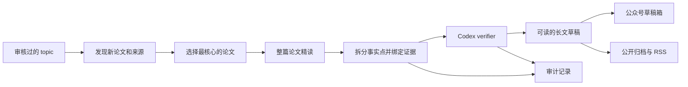

# ResearchRadar


ResearchRadar 面向想自托管研究日报的人：给它一个审核过的研究 topic，它每天发现新论文，
精读最值得看的几篇，用原文证据核验公开事实点，然后把一篇中文长文放进公众号草稿箱。
你只需要去草稿箱审稿，而不是每天重新搜论文、读 PDF、整理证据。同一份已核验文章也可以
导出成静态公开归档和 RSS。

`本地优先` · `证据门控` · `整篇论文精读` · `微信公众号草稿` · `Archive/RSS`

`DeepSeek reader` · `Codex verifier` · `Tavily 召回` · `OpenAI-compatible providers`

[English README](README.md) · [详细使用说明](docs/usage.md) ·
[Provider 配置](docs/providers.md) · [架构](docs/architecture.md) · [安全说明](docs/security.md)

## 它解决什么问题

多数 research bot 会总结它搜到的内容；ResearchRadar 更保守。搜索只负责补召回，公开正文里的事实
必须来自已经读取的论文或可信来源，并且要有完整的 evidence anchor。

### 一篇日报是怎么生成的



默认日报链路是：

1. 用 paper-first ranking 和 Tavily 补充召回；
2. 用 DeepSeek v4 Pro 精读选中的论文；
3. 用 Codex `gpt-5.5` 检查可发布 claim；
4. 渲染成可读的中文长文；
5. 创建微信公众号草稿，只进草稿箱，不自动发布。

## 每次运行会得到什么

一次成功的日报会生成：

- 一篇可以直接在微信公众号后台审阅的长文草稿；
- 一份从同一已核验草稿导出的可选静态文章归档和 RSS；
- 一个带安全论文图的本地 HTML 预览；
- 一组带原文证据锚点的 verified claims；
- 一套记录 rejected / weak / unsupported claim 的审计 artifacts。

## 快速开始

日常使用分两步：第一次配好 topic、密钥和 scheduler；之后每天去微信公众号草稿箱审稿。

安装依赖并初始化本地配置：

```bash
uv sync --extra dev
uv run research-radar init
```

`config.example.yaml` 是公开模板。正式 topic 和日常偏好放在本地 `config.yaml`；
`config.yaml` 已被 gitignore 覆盖，不应提交。

把本地密钥存进 Keychain，并检查状态：

```bash
uv run research-radar secrets set deepseek
uv run research-radar secrets set web-search
uv run research-radar secrets set wechat
uv run research-radar secrets status
```

运行一次日报：

```bash
uv run research-radar run daily \
  --topic <topic-id> \
  --config config.yaml \
  --root research-radar-data \
  --language zh \
  --model-cache
```

如需公开归档，可以把这次 run 导出成静态网页和 RSS：

```bash
uv run research-radar archive export \
  --run runs/<date-topic> \
  --output public-archive \
  --base-url https://research.example.com \
  --site-language zh
```

这条命令只生成静态文件，不负责部署到 GitHub Pages、Vercel、Cloudflare Pages 或个人域名。

创建微信公众号草稿：

```bash
uv run research-radar publish wechat-draft \
  --run runs/<date-topic> \
  --title "ResearchRadar 日报：<topic>" \
  --digest "今日精选 <topic> 相关论文精读。" \
  --thumb-media-id "<wechat-thumb-media-id>"
```

生成本地定时任务：

```bash
uv run research-radar schedule daily-draft \
  --topic <topic-id> \
  --time 09:00 \
  --config config.yaml \
  --root research-radar-data \
  --thumb-media-id "<wechat-thumb-media-id>" \
  --language zh \
  --model-cache
```

## 质量边界

公开报告只展示 supported 且 evidence anchor 完整的 claim。弱证据、拒绝项、调试信息和审计记录会留在
本地 artifacts 里，不会混进普通读者看到的正文。

Xiaomi `mimo-v2.5-pro` 已作为可选 OpenAI-compatible provider 接入，可以显式替代 DeepSeek 路由；
默认路径仍保持 DeepSeek reader 和 Codex verifier。

## 更多文档

- [详细使用说明](docs/usage.md)：安装、密钥、日报、单篇论文、Archive/RSS、微信草稿、scheduler、隐私检查。
- [Provider 配置](docs/providers.md)：如何接入 Kimi、Qwen、Minimax、本地 OpenAI-compatible 服务或 CLI agent。
- [架构](docs/architecture.md)：从 source discovery 到 article draft 的数据流。
- [安全说明](docs/security.md)：本地 secret、隐私扫描和发布边界。
- [路线图](docs/todo.md)：产品和工程 TODO。

## License

MIT
