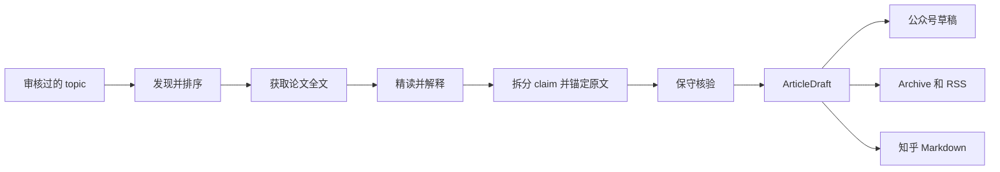

# ResearchRadar


**盯住一个研究方向，每天得到一篇能追溯原文的研究长文。**

ResearchRadar 会寻找新工作，挑出真正值得读的论文，读取全文，再逐条核对准备写进正文的事实。
它在本地运行，最后把文章放到你方便审阅的地方：微信公众号草稿箱、带 RSS 的公开网页，
或者适合导入知乎的 Markdown。

[English README](README.md) ·
[在线 Archive](https://sleepylgod.github.io/research-radar/archive/) ·
[RSS](https://sleepylgod.github.io/research-radar/archive/feed.xml) ·
[使用说明](docs/usage.md) · [Provider 配置](docs/providers.md)

`本地运行` · `读取论文全文` · `证据核验` · `不会自动发布`

## 你会得到什么

- **一份重点明确的日报。** 搜索会尽量找全，但选源优先考虑论文是否真正切中研究方向，不拿一堆
  泛泛的网页结果凑数。
- **真正基于全文的解读。** 对选中的论文解释问题、方法、实验和局限；有合适的论文图时，也会把图
  和正文放在一起讲清楚。
- **可以回查的事实。** 准备公开的事实必须有完整 evidence anchor。证据不足、说得太宽或无法匹配
  原文的 claim 只留在本地审计记录里。
- **一份内容，可以发到不同地方。** 同一个 `ArticleDraft` 可以生成微信公众号草稿、Archive/RSS 网页，
  或者知乎专用 Markdown。

## 它怎么工作



搜索只负责尽量找全，搜索摘要不能直接变成公开事实。ResearchRadar 会先拿到论文全文，再经过
claim 拆分、原文锚定和 verifier 检查，最后才生成给读者看的文章。

## 先跑通一次

你需要 Python 3.12+、`uv`、一个可用的 reader API，以及默认 verifier 使用的 Codex CLI。
微信公众号配置可以晚一点再做，不影响先生成本地日报。

安装依赖并创建本地配置：

```bash
uv sync --extra dev
uv run research-radar init
```

打开 `config.yaml`，把 `example-topic` 换成你已经确认过的研究方向。这个文件已被 gitignore，
正式 topic 和 provider 设置都应该留在这里，不要写进公开模板。

把默认搜索和精读需要的密钥存进 macOS Keychain：

```bash
uv run research-radar secrets set deepseek
uv run research-radar secrets set web-search
uv run research-radar secrets status
```

运行一次：

```bash
uv run research-radar run daily \
  --topic <topic-id> \
  --config config.yaml \
  --root research-radar-data \
  --language zh \
  --model-cache
```

命令结束时会打印 `Created run: <RUN_DIR>`。后续 compose、Archive 和发布命令都使用这个准确路径。
你可以先打开 `<RUN_DIR>/wechat.html`，或者阅读 `<RUN_DIR>/daily.md`。

## 发布与自动运行

- **微信公众号：** 上传安全的论文图并创建草稿，只进草稿箱，不自动发布或群发。
- **Archive 和 RSS：** 导出普通静态文件，可以放到 GitHub Pages 或其他静态托管服务。
  也可以通过配置好的干净 Git checkout 一键提交并推送。
  [在线 Archive](https://sleepylgod.github.io/research-radar/archive/) 是一个真实部署示例。
- **知乎：** 生成专门适配知乎标题和列表层级的 Markdown，并支持本地图片包或公网图片 URL，供人工导入。
- **私人邮件：** 通过 TLS 保护的 SMTP，把同一份已核验日报发到自己的邮箱。
- **本地 scheduler：** 生成 macOS launchd 任务，定时运行审核过的 topic 并创建公众号草稿。

具体命令和部署步骤见[详细使用说明](docs/usage.md)。

## 默认模型可以替换

当前默认使用 DeepSeek v4 Pro 精读论文、轻量 DeepSeek 路由生成 gist 和中文表达、Tavily 补充网页召回，
再由 Codex `gpt-5.6-terra` 以 `high` reasoning 做 verifier。默认值只是经过验证的组合，不是硬编码限制；
自定义 API、本地模型和 CLI agent 的接入方式见 [Provider 配置](docs/providers.md)。

## 内容边界

给读者看的报告只使用 supported 且 evidence anchor 完整的 claim。被拒绝的 claim、弱证据、选源细节、
provider 报错和运行耗时仍会保存在本地 artifacts 中，方便排查，但不会混进正文。Renderer 可以重新组织
已经核验的内容，不能自己补研究结论。

ResearchRadar 是自托管工具，不是在线研究服务。Secret 保存在本地，也不会自动把内容发布到公众号、
公开 Archive 或知乎。

## 文档

- [详细使用说明](docs/usage.md)
- [Provider 配置](docs/providers.md)
- [架构](docs/architecture.md)
- [安全说明](docs/security.md)
- [路线图](docs/todo.md)

## License

MIT
